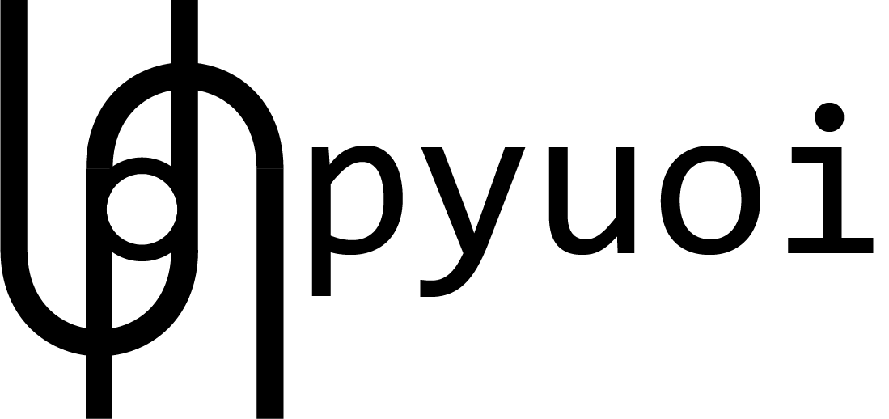

 [](https://codecov.io/gh/BouchardLab/PyUoI)
[](https://pyuoi.readthedocs.io/en/latest/?badge=latest)

[](https://conda.anaconda.org/conda-forge)

PyUoI contains implementations of Union of Intersections framework for a variety
of penalized generalized linear models as well as dimensionality reductions
techniques such as column subset selection and non-negative matrix
factorization. In general, UoI is a statistical machine learning framework that
leverages two concepts in model inference:

1. Separating the selection and estimation problems to simultaneously achieve
   sparse models with low-bias and low-variance parameter estimates.
2. Stability to perturbations in both selection and estimation.


PyUoI is designed to function similarly to ``scikit-learn``, as it often builds
upon ``scikit-learn``'s implementations of the aforementioned algorithms.

Further details on the UoI framework can be found in the NeurIPS paper (<a href="https://papers.nips.cc/paper/6708-union-of-intersections-uoi-for-interpretable-data-driven-discovery-and-prediction">Bouchard et al., 2017</a>).

# Installation

PyUoI is available for Python 3 on PyPI:

```
pip install pyuoi
```

and through conda-forge:

```
conda install pyuoi -c conda-forge
```

# Requirements

## Runtime

PyUoI requires

* numpy>=1.14
* h5py>=2.8
* scikit-learn>=0.20

and optionally

* pycasso
* mpi4py

to run.

## Develop

To develop PyUoI you will additionally need

* cython

to build from source and

* pytest
* flake8

to run the tests and check formatting.

# Features

PyUoI is split up into two modules, with the following UoI algorithms:

* `linear_model` (generalized linear models)
    * Lasso penalized linear regression UoI<sub>Lasso</sub>.
    * Elastic-net penalized linear regression (UoI<sub>ElasticNet</sub>).
    * Logistic regression (Bernoulli and multinomial) (UoI<sub>Logistic</sub>).
    * Poisson regression (UoI<sub>Poisson</sub>).
* `decomposition` (dimensionality reduction)
    * Column subset selection (UoI<sub>CSS</sub>).
    * Non-negative matrix factorization (UoI<sub>NMF</sub>).

Similar to `scikit-learn`, each UoI algorithm has its own Python class.

# Documentation

Please see our <a href="https://pyuoi.readthedocs.io/en/latest/">ReadTheDocs</a> page for an introduction to Union of Intersections, usage of PyUoI, and the API.

# Copyright

PyUol Copyright (c) 2019, The Regents of the University of California, through Lawrence Berkeley National Laboratory (subject to receipt of any required approvals from the U.S. Dept. of Energy).  All rights reserved.

If you have questions about your rights to use or distribute this software, please contact Berkeley Lab's Innovation & Partnerships Office at  IPO@lbl.gov referring to " PyUol" (LBNL Ref 2019-157)."

NOTICE.  This software was developed under funding from the U.S. Department of Energy.  As such, the U.S. Government has been granted for itself and others acting on its behalf a paid-up, nonexclusive, irrevocable, worldwide license in the Software to reproduce, prepare derivative works, and perform publicly and display publicly.  The U.S. Government is granted for itself and others acting on its behalf a paid-up, nonexclusive, irrevocable, worldwide license in the Software to reproduce, prepare derivative works, distribute copies to the public, perform publicly and display publicly, and to permit others to do so.
